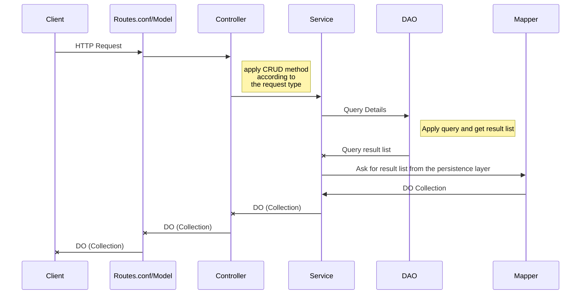

# Task Manager RESTful-API
A RESTful API for Task management created by Hadas [**hadasG4456**](https://github.com/hadasG4456) and Tom [**ToMax446**](https://github.com/ToMax446).
This API was created using [**Play Framework**](https://www.playframework.com/), which in turn is built with the [**AKKA toolkit**](https://akka.io/), An implementation to the Actor model for reactive, concurrent and distributed applications.

## Requirements
The project was built using Play version 2.8.13 and as such requires:
 - Java SE 8-11
 - sbt, we used version 1.4.5

## Activation

Simply running the command `sbt run` in command prompt.

## Usage
You can use several different requests using [**Swagger**](mbarsinai.com/files/bgu/2022a/miniproj/swagger/)
|Request                        |Routings                            |
|-------------------------------|------------------------------------|
|GET all people                 |localhost:9000/api/people           |
|POST a person                  |localhost:9000/api/people           |
|GET a person                   |localhost:9000/api/people/{id}      |
|PATCH a person                 |localhost:9000/api/people/{id}      |
|DELETE a person                |localhost:9000/api/people/{id}      |
|GET all tasks of a person      |localhost:9000/api/people/{id}      |
|POST a task to a person        |localhost:9000/api/people/{id}      |
|GET a task                     |localhost:9000/api/tasks/{id}       |
|PATCH a task                   |localhost:9000/api/tasks/{id}       |
|DELETE a task                  |localhost:9000/api/tasks/{id}       |
|GET a task's status            |localhost:9000/api/tasks/{id}/status|
|PUT new status to a task       |localhost:9000/api/tasks/{id}/status|
|GET a task's owner id          |localhost:9000/api/tasks/{id}/owner |
|PUT new owner id to a task     |localhost:9000/api/tasks/{id}/status|

## Notes on the project

### Data corruption
In our project, we used the DAO/DTO model in the MVC pattern. We checked the data before inserting or updating the persistence layer, and only after validating the required fields we inserted/merged our DTOs into the database. Using JPA to query from the database, helped us utilize the safety and instructions from JAVA to keep our data valid.
### Connection to the Database
We used JPA and H2 to implement our persistence layer. Combined with using the DTO/DAO model it made the work with the database a breeze.
For example: `SELECT c FROM Country c WHERE c.population > :p` would turn to:

` CriteriaBuilder cb = em.getCriteriaBuilder();`

`CriteriaQuery<Country> q = cb.createQuery(Country.class);`

`Root<Country> c = q.from(Country.class);`

`ParameterExpression<Integer> p = cb.parameter(Integer.class);`

`q.select(c).where(cb.gt(c.get("population"), p)); `

which may seem longer, but it helps us keep it simple with longer, more complex queries while also gaining the benefits of using java and not a string of SQL, like type safety, etc.
### Parsing JSONs
As far as parsing the JSONs received from the HTTP request, Play made it for us. Play is using Jackson to handle the JSON, and could instantly create an object from the JSON, using the `Json.fromJson(JsonNode, object.class)`. This method created us the DTO, which we could then use to merge with our persistence layer.

## UML diagram of the project

Appearntly Github doesn't work well with [Mermaid](https://mermaidjs.github.io/), so here's a picture of the UML:

